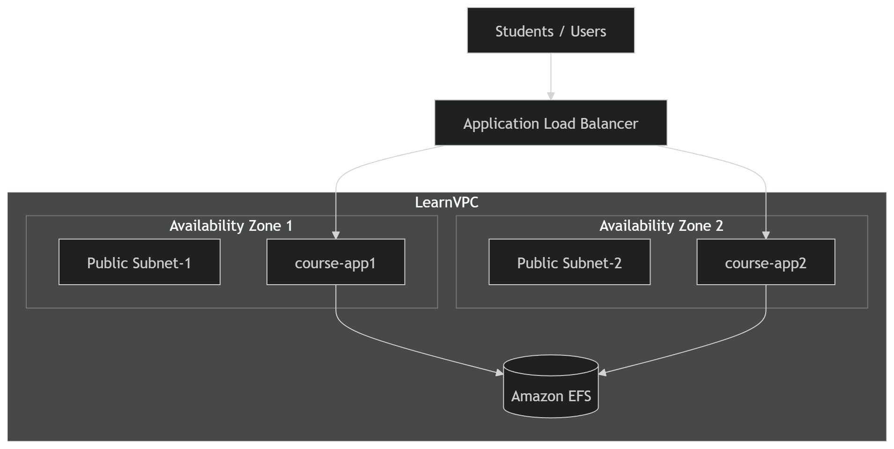
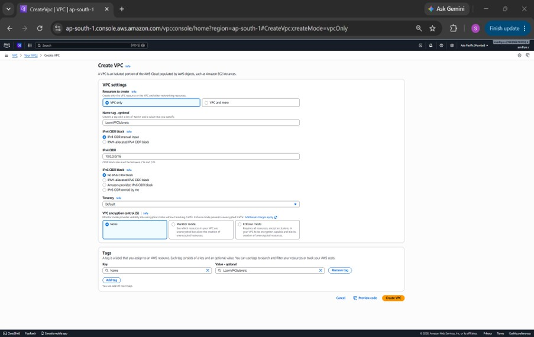
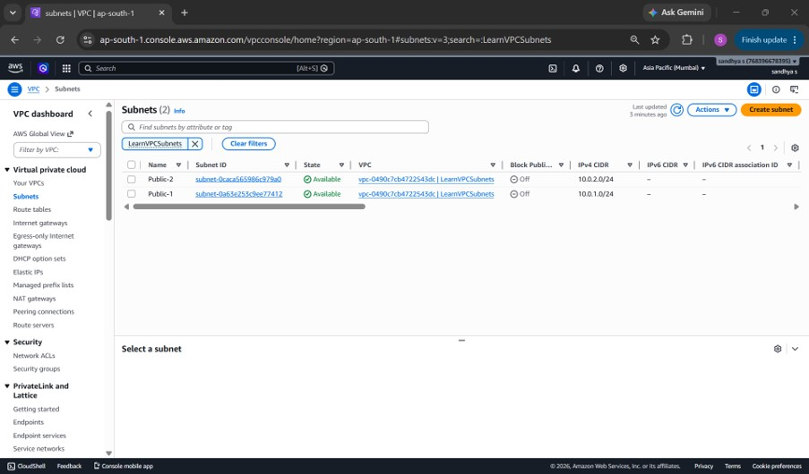
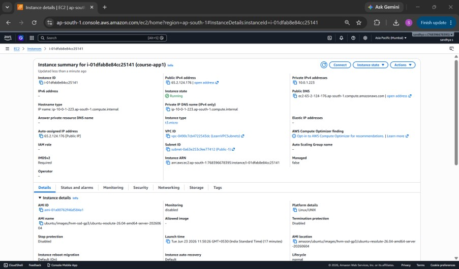
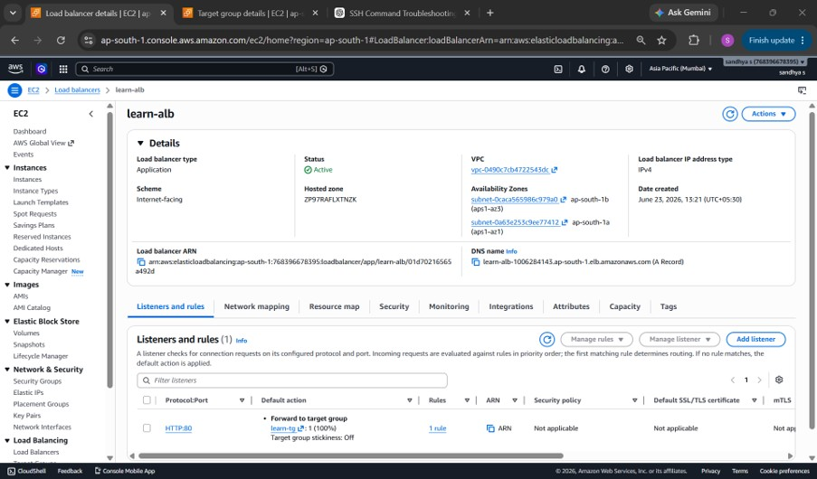

# 🚀 Highly Available Infrastructure for Online Learning Platform

## 📖 Project Overview

This project demonstrates the deployment of a highly available web infrastructure on AWS for an online learning platform. The architecture is designed to provide redundancy, centralized file sharing, and balanced traffic distribution across multiple Availability Zones.

The solution leverages Amazon VPC, EC2, Application Load Balancer (ALB), and Amazon Elastic File System (EFS) to ensure high availability, fault tolerance, and shared storage access across web servers.

---

# 🏗️ Architecture Diagram



---

# 🔄 Architecture Flow

1. Users access the application through the Application Load Balancer (ALB).
2. The ALB distributes incoming traffic between two EC2 instances.
3. EC2 instances are deployed in separate Availability Zones.
4. Amazon EFS provides centralized shared storage accessible from both instances.
5. Content created on one server becomes immediately available on the other server.
6. This architecture provides high availability and fault tolerance.

---

# 📋 Prerequisites

Before deployment, ensure you have:

- AWS Account
- IAM User with appropriate permissions
- EC2 Key Pair
- Basic Linux knowledge
- Internet access

---

# 🛠️ Infrastructure Components

| Service | Purpose |
|----------|----------|
| Amazon VPC | Network Isolation |
| Public Subnets | Host Public Resources |
| EC2 Instances | Web Servers |
| Application Load Balancer | Traffic Distribution |
| Amazon EFS | Shared Storage |
| Security Groups | Traffic Control |
| Internet Gateway | Internet Connectivity |

---

# 🌐 VPC Setup

## VPC Configuration

| Resource | Value |
|-----------|---------|
| VPC Name | LearnVPC |
| CIDR Block | 10.0.0.0/16 |

## Public Subnets

| Subnet | Availability Zone | CIDR |
|----------|------------------|---------|
| Public-1 | AZ-1 | 10.0.1.0/24 |
| Public-2 | AZ-2 | 10.0.2.0/24 |

## Internet Gateway

Attached to LearnVPC to provide internet access.

## Route Table

Configured with:

```text
0.0.0.0/0 → Internet Gateway
```

### Screenshots

#### VPC and Public Subnets





#### VPC Resource Map


#### Route Table


#### Security Group


---

# 🖥️ EC2 Setup

Two EC2 instances were launched in separate public subnets.

| Instance Name | Purpose |
|---------------|----------|
| course-app1 | Web Server |
| course-app2 | Web Server |

## User Data Script - course-app1

```bash
#!/bin/bash

apt update -y
apt install apache2 -y

systemctl start apache2
systemctl enable apache2

echo "Welcome to Course App 1" > /var/www/html/index.html
```

## User Data Script - course-app2

```bash
#!/bin/bash

apt update -y
apt install apache2 -y

systemctl start apache2
systemctl enable apache2

echo "Welcome to Course App 2" > /var/www/html/index.html
```

### Screenshots

#### course-app1



#### course-app2


---

# ⚖️ Application Load Balancer (ALB)

An internet-facing Application Load Balancer was created to distribute traffic across both EC2 instances.

## ALB Configuration

| Setting | Value |
|----------|---------|
| Type | Application Load Balancer |
| Scheme | Internet Facing |
| Listener | HTTP : 80 |

## Target Group

Registered Targets:

- course-app1
- course-app2

## Health Check

```text
/index.html
```

## Traffic Distribution

Weighted routing was configured:

| Instance | Weight |
|------------|-----------|
| course-app1 | 60 |
| course-app2 | 40 |

### Screenshots

#### ALB Configuration



#### ALB Listener Rule


#### Healthy Target Group


#### Website Access Through ALB DNS


---

# 📂 Amazon EFS Setup

Amazon Elastic File System (EFS) was created to provide centralized shared storage between both EC2 instances.

## EFS Configuration

- File System Created
- Mount Targets Created in Both Availability Zones
- NFS Protocol Used

## Install NFS Utilities

```bash
sudo apt update
sudo apt install nfs-common -y
```

## Create Mount Directory

```bash
sudo mkdir /efs
```

## Mount EFS

```bash
sudo mount -t nfs4 -o nfsvers=4.1 \
fs-xxxxxxxx.efs.ap-south-1.amazonaws.com:/ /efs
```

---

# ✅ Shared Storage Verification

### On course-app1

```bash
echo "Hello from EFS" > /efs/test.txt
```

### On course-app2

```bash
cat /efs/test.txt
```

### Output

```text
Hello from EFS
```

This confirms that both EC2 instances are successfully accessing the same shared storage.

### Screenshots

#### EFS Configuration


#### EFS Mounted on Both EC2 Instances


#### Shared Storage Verification


---

# 🔐 Security Configuration

## EC2 Security Group

| Type | Port |
|--------|--------|
| SSH | 22 |
| HTTP | 80 |

## EFS Security Group

| Type | Port |
|--------|--------|
| NFS | 2049 |

Allowed Source:
- EC2 Security Group

---

# 🧪 Deployment Verification

### Validation Checklist

- ✅ LearnVPC created successfully
- ✅ Public subnets created across multiple Availability Zones
- ✅ Internet Gateway attached
- ✅ Route tables configured
- ✅ Security Groups configured
- ✅ EC2 instances launched successfully
- ✅ Apache installed through User Data
- ✅ ALB configured successfully
- ✅ Target Group healthy
- ✅ Website accessible through ALB DNS
- ✅ EFS created successfully
- ✅ EFS mounted on both EC2 instances
- ✅ Shared file accessible from both servers

---

# ⚠️ Challenges Faced

### 1. EFS Mount Configuration
I initially couldn't access the EFS mount from my EC2 instances because the NFS port wasn't configured correctly in the security group.

### 2. Target Group Health Check Failures
Instances initially showed unhealthy status. Fixed by ensuring Apache service was running and the health check path was accessible.

### 3. Multi-AZ Deployment Validation
Verified that EC2 instances were deployed in separate Availability Zones to ensure high availability.

### 4. Shared Storage Testing
Validated EFS functionality by creating files on one instance and accessing them from another instance.

---

# 📚 Learning Outcomes

Through this project, I gained hands-on experience with:

- Amazon VPC Networking
- Multi-AZ Architecture
- EC2 Deployment
- Apache Web Server Configuration
- Application Load Balancer Setup
- Amazon EFS Shared Storage
- High Availability Design
- AWS Troubleshooting and Validation

---

# 🎯 AWS Services Used

- Amazon VPC
- Amazon EC2
- Application Load Balancer (ALB)
- Amazon Elastic File System (EFS)
- Security Groups
- Route Tables
- Internet Gateway

---

# 🏁 Conclusion

This project successfully demonstrates a highly available AWS infrastructure for an online learning platform. By integrating EC2, ALB, EFS, and VPC networking, the solution provides redundancy, centralized storage, fault tolerance, and efficient traffic distribution.

This architecture closely resembles real-world production environments and serves as a strong foundation for advanced AWS and DevOps projects.

---

## 👩‍💻 Author

**Sandhya S**

AWS | DevOps | Cloud Enthusiast

Building hands-on cloud and DevOps projects to strengthen practical skills and industry readiness.
